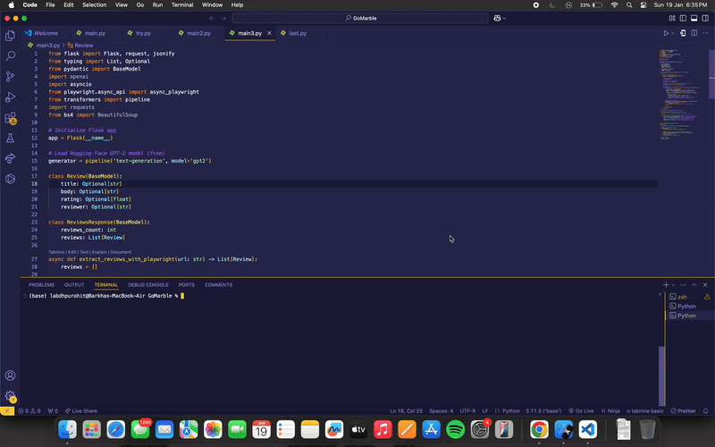

# Flask Review Scraper and Text Generator

This project is a Flask-based web application that allows users to extract product reviews from a given URL, leveraging Playwright for web scraping. The app also generates CSS selectors to identify review sections dynamically. Additionally, it uses a pre-trained GPT-2 model from Hugging Face's `transformers` library to help generate and identify these selectors based on the HTML content.

## Features
- **Extract Reviews:** Scrapes reviews from a given webpage URL.
- **Text Generation:** Uses GPT-2 to generate CSS selectors to identify review sections dynamically.
- **Pagination Support:** Handles multiple pages of reviews using the "next" button.
- **API Endpoint:** Provides an API (`/api/reviews`) to fetch the extracted reviews in JSON format.

## How It Works

1. **Extracting Reviews with Playwright:**
   - The `extract_reviews_with_playwright()` function uses Playwright (an asynchronous browser automation tool) to open the provided URL.
   - It scrapes the review data such as the title, body, rating, and reviewer of each review.
   - It also handles pagination by clicking the "Next" button to gather reviews from multiple pages.

2. **CSS Selector Generation:**
   - The `identify_css_selectors()` function generates the required CSS selectors dynamically using a pre-trained **GPT-2 model**.
   - The GPT-2 model is accessed through the Hugging Face `transformers` library, which generates CSS selectors based on the HTML content of the page.
   - If selector generation fails, fallback selectors are used.

3. **API Endpoint:**
   - A simple API is exposed at `/api/reviews` where users can provide a `page` query parameter (the URL of the page from which to scrape reviews).
   - The response will be in JSON format, containing the reviews' details and a count of total reviews.

## Demo

## Model Used
- GPT-2 (Generative Pretrained Transformer 2): The GPT-2 model is used for generating dynamic CSS selectors based on the HTML content of the webpage. This model was fine-tuned for text generation tasks, allowing it to predict and generate selector patterns that match the review sections on the page.
- Playwright: A browser automation tool used for web scraping. It is used to open the provided URL, extract review data, and handle pagination.

## Conclusion
- This project combines web scraping and text generation techniques to offer a flexible and dynamic way of gathering reviews from product pages. The integration of GPT-2 allows the app to adapt to different review structures, making it a useful tool for various websites.
